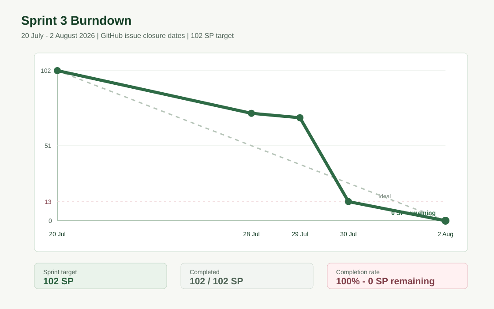

# Sprint 3 Burndown

Sprint 3 hedefi 102 story point olarak planlandı. Gerçekleşen çizgi, GitHub
issue kapanış tarihleri kullanılarak oluşturuldu; iletişim kayıtlarından tahmini
tamamlanma tarihi üretilmedi.

## Kalan Puan Akışı

| Tarih | Kapanan Issue'lar | Tamamlanan SP | Kalan SP |
| --- | --- | ---: | ---: |
| 20 Temmuz | Sprint başlangıcı | 0 | 102 |
| 28 Temmuz | #5, #6, #7, #8, #10 | 29 | 73 |
| 29 Temmuz | #19 | 32 | 70 |
| 30 Temmuz | #9, #11, #12, #13, #14, #15, #16, #17, #18 | 89 | 13 |
| 2 Ağustos | #20, #21, #22 | 102 | 0 |

## Kapanış Projeksiyonu

| Kapanış PBI | SP | Durum |
| --- | ---: | --- |
| #20 Scrum ve teknik teslim belgeleri | 5 | Done |
| #21 Demo videosu ve linki | 5 | Done |
| #22 Final release kabulü | 3 | Done |

Sprint sonunda hedeflenen 102 SP'nin tamamı kabul edildi ve kalan iş 0 SP
olarak kapatıldı.

## Yorum

Sprintin ilk haftasında AI bağlamı ve cevap sözleşmesi geliştirildi.
Issue kapanışlarının 28-30 Temmuz'da yoğunlaşması, entegrasyon ve test
işlerinin toplu kabul edilmesinden kaynaklandı. Son 13 SP, Scrum kanıt paketi,
demo videosu ve final release kontrolü tamamlanınca kapatıldı.
