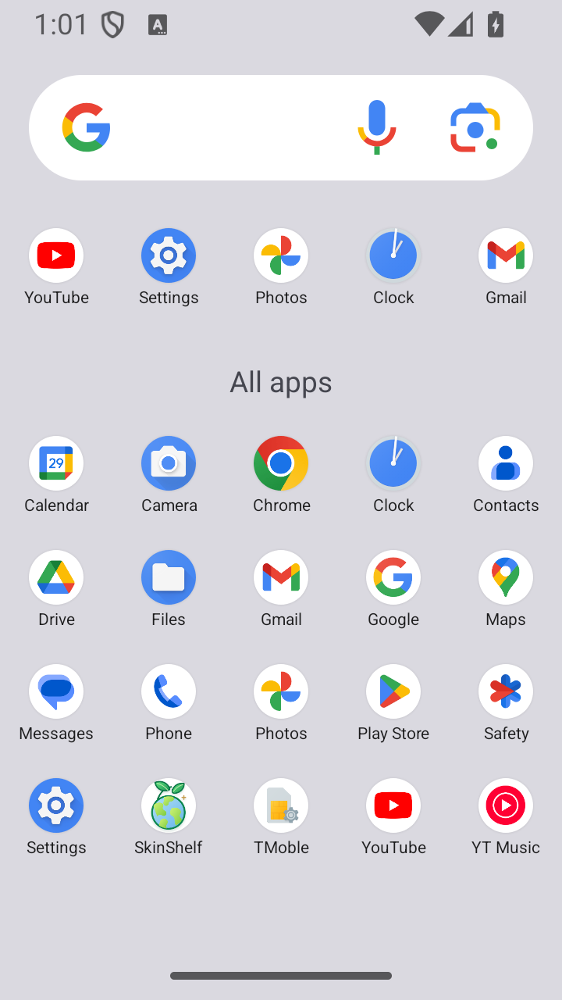
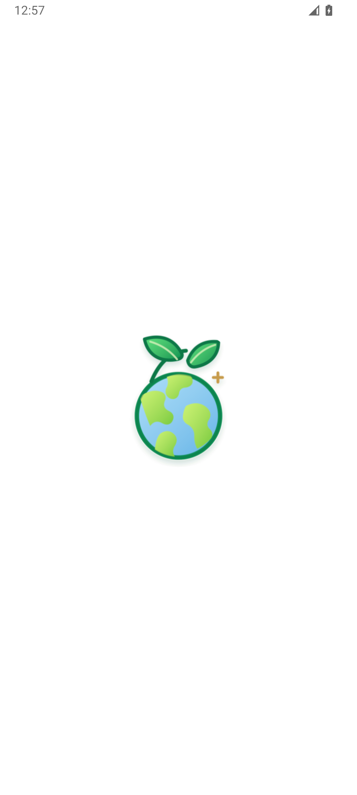
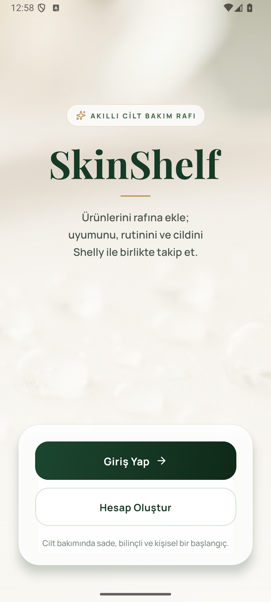
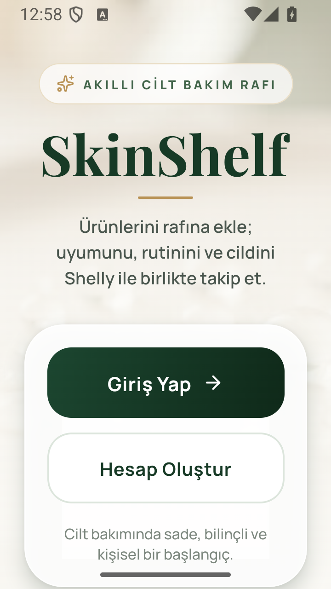
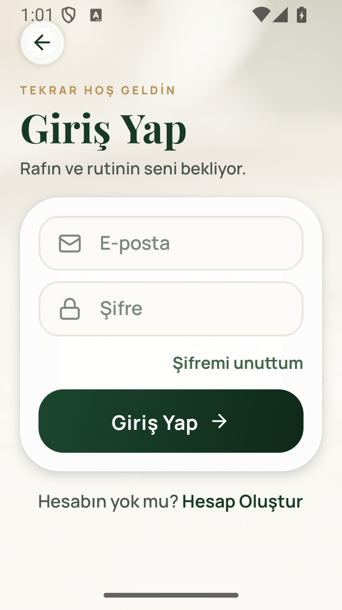
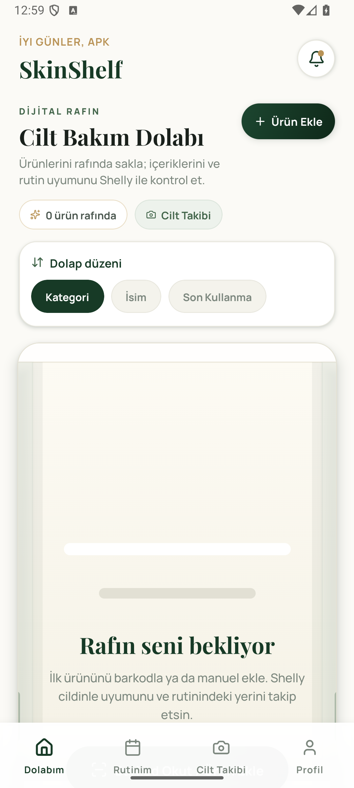
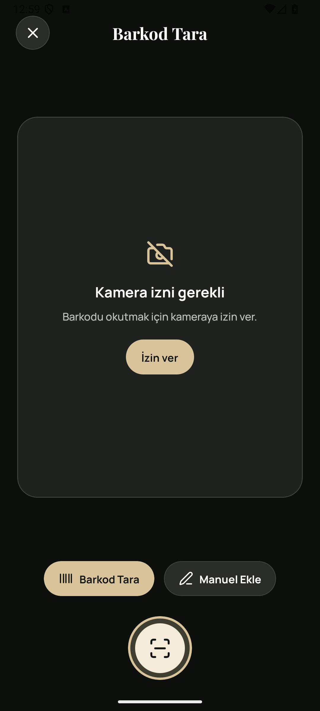
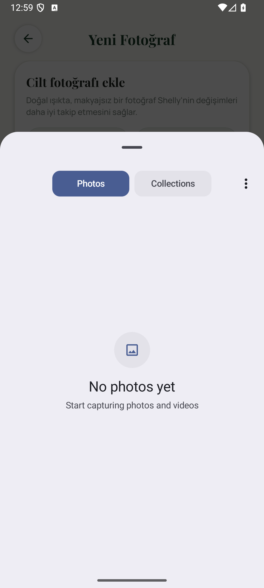
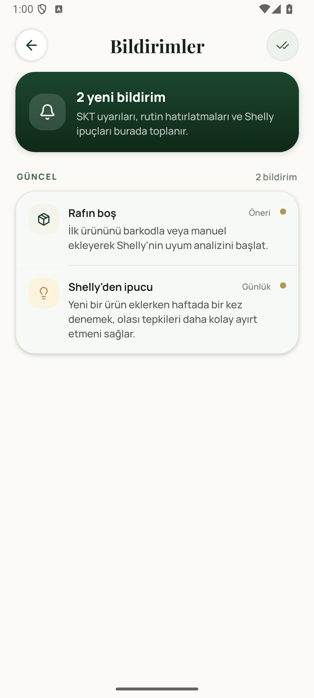

# Sprint 3 Ürün Durumu

Bu galeri Sprint 3 sonunda üretilen Android preview build'in açılış, auth,
izin, ana ekran ve bildirim davranışlarını gösterir. Görseller test amaçlı
kişisel veri veya production secret içermez.

## Release Açılışı ve Auth

| Launcher | Splash | Login |
| --- | --- | --- |
|  |  |  |

| Compact login | Compact sign-in | Canlı ana ekran |
| --- | --- | --- |
|  |  |  |

## Kamera, Fotoğraf ve Bildirim

| Kamera izni | Sistem fotoğraf seçici | Bildirim merkezi |
| --- | --- | --- |
|  |  |  |

## Uçtan Uca Ana Akışlar

Dolap, ürün detayı, haftalık rutin, Shelly hafızası ve profil/Supabase
ekranlarının canlı backend ile alınmış görüntüleri aşağıdaki galeride
saklanır:

- [Canlı Android ürün galerisi](../../Sprint_2/Product_Screenshots/README.md)
- [Gerçek cihaz release candidate testi](../RELEASE-CANDIDATE-TEST.md)
- [Preview APK temiz kurulum kanıtı](../android-preview-apk-verification.md)

## Kabul Kapsamı

- Standart ve compact Android ekranlarda auth alanları taşmıyor.
- Kamera ve fotoğraf izinleri yalnızca ilgili kullanıcı aksiyonunda isteniyor.
- Ana ekran canlı backend verisiyle açılıyor.
- Bildirim merkezi rutin ve ürün hatırlatma kayıtlarını gösteriyor.
- APK cold start, logout ve hesap silme dahil ana regresyon akışından geçti.
