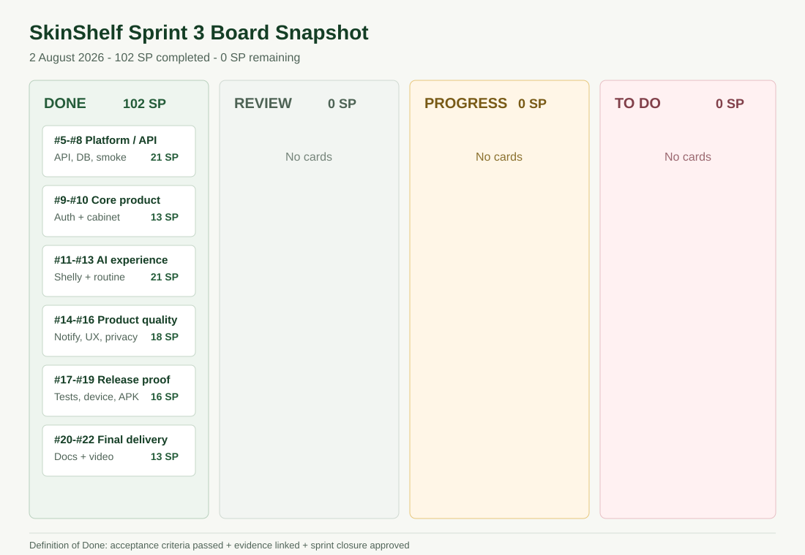

# Sprint 3 - Final Ürünleştirme ve Teslim

**Sprint tarihleri:** 20 Temmuz - 2 Ağustos 2026
**Sprint hedefi:** SkinShelf'i kurulabilir, gerçek cihazda test edilmiş,
AI davranışı ölçülmüş ve uçtan uca demo edilebilir final ürüne taşımak.
**Sonuç:** 102/102 SP tamamlandı, kalan iş 0 SP.

## Sprint Sonu Beklentileri

| Beklenti | Durum | Kanıt |
| --- | --- | --- |
| Backlog dağıtma mantığı | Tamamlandı | [102 SP issue bazlı plan](sprint3-story-points.md) |
| Daily Scrum notları | Tamamlandı | [Repository ile doğrulanabilir daily kaydı](Daily_Scrum/README.md) |
| Sprint board updates | Tamamlandı | [Başlangıç, orta ve kapanış board kanıtı](Sprint_Board/README.md) |
| Ürün durumu | Tamamlandı | [Final Android ekran galerisi](Product_Screenshots/README.md) |
| Sprint Review | Tamamlandı | [Review ve kabul sonuçları](Review_and_Retrospective/README.md) |
| Sprint Retrospective | Tamamlandı | [İyi gidenler, zorluklar ve aksiyonlar](Review_and_Retrospective/README.md) |

## Scrum ve Kapanış Kanıtları

- [Sprint board ve backlog takibi](Sprint_Board/README.md)
- [Sprint 3 story point dağılımı](sprint3-story-points.md)
- [Daily Scrum kaydı](Daily_Scrum/README.md)
- [102 SP'den 0 SP'ye burndown](Burndown_Chart/README.md)
- [Sprint Review ve Retrospective](Review_and_Retrospective/README.md)
- [Final hazırlık ve Definition of Done](Final_Readiness.md)

## Tamamlanan Ürün Artımı

- Production API, Supabase PostgreSQL ve migration altyapısı doğrulandı.
- Auth, onboarding, güvenli oturum ve hesap/veri silme akışları kapatıldı.
- Kalıcı ürün dolabı; barkod, fotoğraf ve manuel ekleme akışlarıyla
  tamamlandı.
- Dolaptaki aktif ürünlerle günlük/haftalık rutin senkronizasyonu tamamlandı.
- Shelly'nin profil, dolap, bilgi tabanı ve sohbet hafızasını kullanan
  yapılandırılmış cevap akışı tamamlandı.
- Güçlü aktifleri aynı geceye yerleştirmeyen deterministik rutin politikası
  mobil ve backend katmanlarında uygulandı.
- Cilt fotoğraf analizi, geçmiş, haftalık özet ve rutin/bitme bildirimleri
  tamamlandı.
- Loading, error, empty state, erişilebilirlik ve compact Android ekran geçişi
  yapıldı.
- Preview APK, temiz emülatör ve gerçek Android cihazda kabul testinden geçti.

## AI ve Teknik Kalite

| Kanıt | Sonuç | Dosya |
| --- | ---: | --- |
| Shelly otomatik yönlendirme eval | 100/100 | [shelly-evaluation-report.md](shelly-evaluation-report.md) |
| Shelly yanıt kalitesi / red-team | 12/12 | [shelly-evaluation-report.md](shelly-evaluation-report.md) |
| Backend otomatik test | 67/67 | [Test indeksi](Test_and_Verification.md) |
| Backend JaCoCo | %75,55 satır / %51,32 branch | [Kalite kapıları](../../docs/engineering-quality.md) |
| Mobil servis/regresyon testi | 19/19 | [Test indeksi](Test_and_Verification.md) |
| İzole full-stack smoke | 4/4 profil | [Test indeksi](Test_and_Verification.md) |
| Production dependency audit | 0 açık | [CI workflow](../../.github/workflows/quality-check.yml) |
| Canlı API smoke | Geçti | [live-api-smoke-report.md](live-api-smoke-report.md) |
| Güvenlik ve gizlilik | Geçti | [Security-and-Privacy-Validation.md](Security-and-Privacy-Validation.md) |

Shelly eval seti; product analysis, routine check, ingredient analysis, skin
reaction, weekly plan ve general chat olmak üzere altı cevap modunu kapsar.
Rutin politika motoru, model cevabından bağımsız olarak yalnız aktif raf
ürünlerini kullanır; retinoid ve güçlü asitleri ayrı gecelere yerleştirir.

## Gerçek Cihaz, Build ve Demo

- [POCO X6 Pro gerçek cihaz regression testi](RELEASE-CANDIDATE-TEST.md)
- [EAS preview APK ve temiz kurulum](android-preview-apk-verification.md)
- [Deployment ve build notları](Deployment_Notes.md)
- [Demo akışı, ekran seti ve video durumu](demo-and-device-evidence.md)
- [Final Android ekranları](Product_Screenshots/README.md)

Final demo videosu ekip teslim paketinde tamamlandı. Public video URL'si bu
repository kopyasında bulunmadığı için tahmini bir URL eklenmedi.

## Kullanıcı Değeri Kanıtı

Sprint 3'te 10 anonim katılımcıyla 10 günlük kullanıcı pilotu raporlandı.
91 aktif kullanıcı-gününde 137/182 rutin tamamlandı; rutin tamamlama oranı
`%75,3`, 10. gün aktifliği `%80` oldu.

- [GitHub'da okunabilir pilot özeti](../../docs/user-research/README.md)
- [Anonim tam PDF raporu](../../docs/user-research/skinshelf-10-day-anonymous-user-pilot.pdf)
- [Pazar potansiyeli ve ürün stratejisi](../../docs/market/README.md)

## Definition of Done

Bir Sprint 3 PBI'ı ancak aşağıdaki koşullarda Done kabul edildi:

- Kabul kriterleri karşılandı.
- Kod TypeScript veya Maven testlerinden geçti.
- Kullanıcı akışı gerekiyorsa emülatör/gerçek cihazda doğrulandı.
- Secret veya kişisel veri repoya eklenmedi.
- Test, ekran, build veya doküman kanıtı linklendi.
- Issue kapanışı ve story point tablosu aynı kapsamı gösterdi.

Sprint 3, 102/102 SP ve 0 kalan PBI ile tamamlandı.
