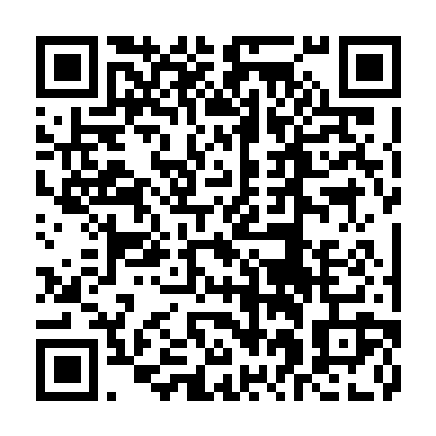

# Android Önizleme Sürümü

SkinShelf `1.0.0 (27)` APK'sı, `d8062e6` kaynak commit'inden EAS üzerinde
üretildi ve kalıcı GitHub Release asset'i olarak yayımlandı.

## İndir ve Kur

[SkinShelf 1.0.0 (27) APK'yı indir](https://github.com/cerensvr/TMGC-Team/releases/download/v1.0.0-preview.27/skinshelf-1.0.0-preview-v27.apk)

1. Bağlantıyı açın veya QR kodunu tarayın.
2. `skinshelf-1.0.0-preview-v27.apk` dosyasını indirin.
3. Android isterse kullanılan tarayıcı için "Bilinmeyen uygulamaları yükle"
   iznini yalnız bu kurulum süresince etkinleştirin.
4. Kurulumdan sonra SkinShelf'i açın.

## Doğrulanan Artifact

| Alan | Değer |
| --- | --- |
| Release | [v1.0.0-preview.27](https://github.com/cerensvr/TMGC-Team/releases/tag/v1.0.0-preview.27) |
| EAS build | [75234d48-047b-4d23-9e61-1ef7fc0a0b78](https://expo.dev/accounts/cernsvr/projects/skinshelf/builds/75234d48-047b-4d23-9e61-1ef7fc0a0b78) |
| Paket | `com.skinshelf.app` |
| minSdk / targetSdk | `24 / 36` |
| Dosya boyutu | `101.871.867` bayt |
| SHA-256 | `ef02edf2b083e51fe44e5437573cf9bf6db9b18a2c4656aea9536986400ef60c` |
| İmza | APK Signature Scheme v2, RSA 2048, tek signer |
| Sertifika SHA-256 | `35ea976c8034bb37b6aa9dbb23a635ba00c35926af18d947271f67b91656b85b` |

GitHub asset digest'i ile indirilen dosyanın yerel SHA-256 değeri eşleşir.
Manifestte `READ_EXTERNAL_STORAGE`, `WRITE_EXTERNAL_STORAGE`, `RECORD_AUDIO`
ve `SYSTEM_ALERT_WINDOW` bulunmaz. Ayrıntılı sonuçlar
[APK doğrulama raporundadır](../../Project_Management_Files/Sprint_3/android-preview-apk-verification.md).

SkinShelf tanı veya tedavi sunmaz. Ciddi ya da devam eden cilt sorunlarında
sağlık uzmanına başvurulmalıdır.
